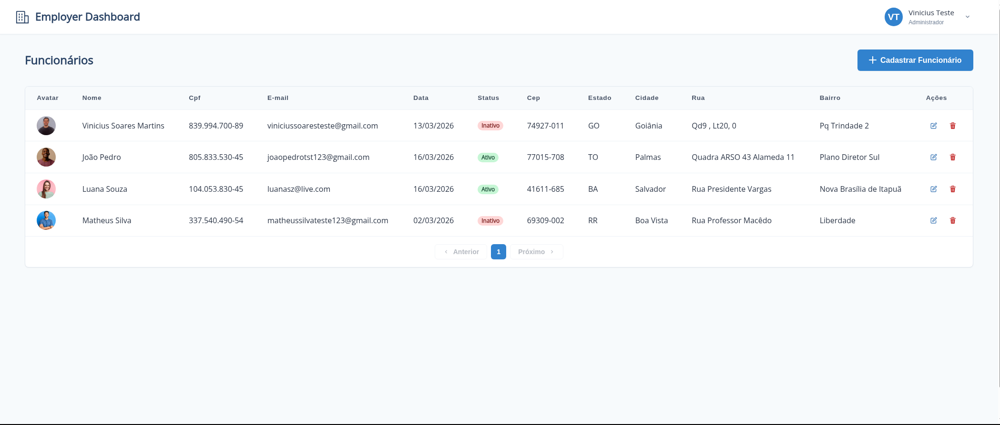
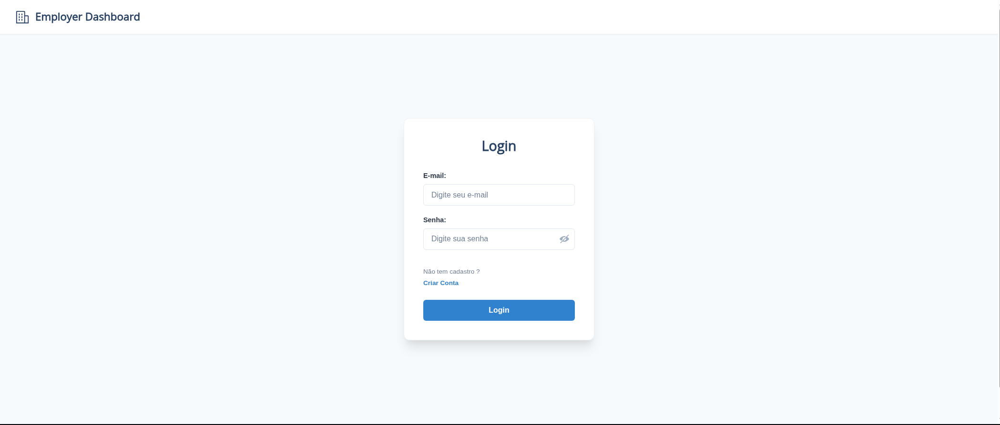
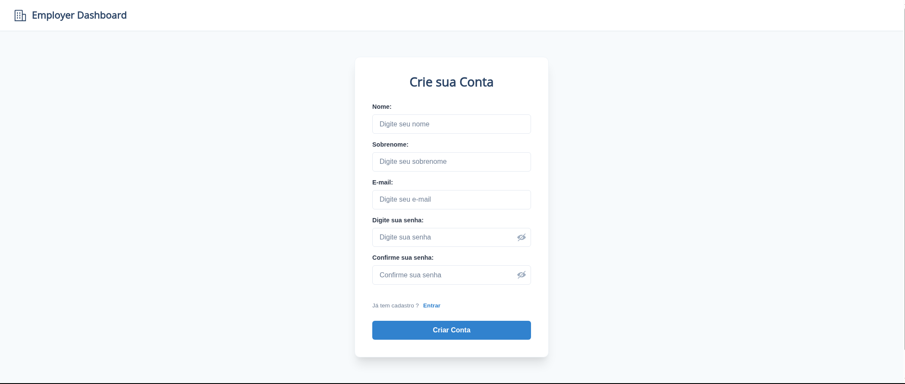
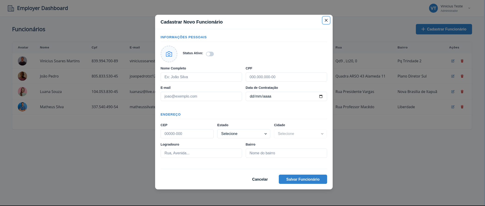
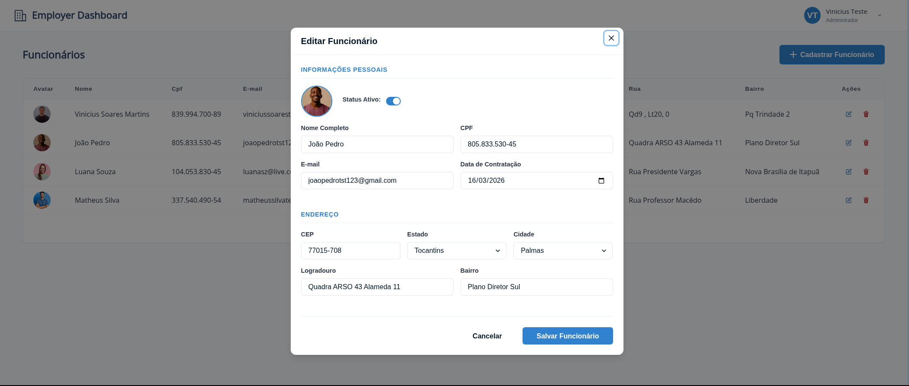

# Employer Dashboard - Sistema de Gestão de Funcionários

O projeto é uma aplicação web de gerenciamento de funcionários, utiliza **React com TypeScript** no frontend, aproveitando o **Chakra UI** para uma interface moderna e responsiva. A gestão de estado e requisições é feita com **React Query** e **Axios**, enquanto formulários são validados com **React Hook Form**. No backend, a API foi construída com **Node.js (TypeScript)**, utilizando **Prisma** como ORM para comunicação com o banco de dados **MongoDB**. Além disso, o backend conta com um sistema de upload de arquivos implementado via middleware **Multer**.

---

## 🛠 Tecnologias Utilizadas

### Frontend

- **React & TypeScript**: Base do desenvolvimento da interface.
- **Chakra UI**: Biblioteca de componentes para design consistente.
- **React Router Dom**: Gerenciamento de rotas e navegação.
- **React Hook Form**: Manipulação e validação de formulários.
- **React Query (TanStack Query)**: Sincronização de dados e cache.
- **Axios**: Cliente HTTP para consumo da API.

### Backend

- **Node.js & TypeScript**: Ambiente de execução e tipagem forte.
- **Express**: Framework para construção de rotas e middlewares.
- **Prisma**: ORM moderno para manipulação do banco de dados.
- **MongoDB**: Banco de dados NoSQL flexível.
- **Multer**: Middleware para upload e processamento de arquivos/imagens.
- **JWT (JSON Web Token)**: Autenticação segura de usuários.

---

## 📸 Capturas de Tela

### Home - Listagem de Funcionários


### Login e Cadastro de Usuário
<p align="center">
  
  
</p>

### Cadastro e Edição de Funcionários
<p align="center">
  
  
</p>

---

## 🚀 Como Rodar o Projeto Localmente

Siga os passos abaixo para configurar o ambiente e executar a aplicação em sua máquina.

### 1. Pré-requisitos

- **Node.js** (Versão LTS recomendada)
- **npm** ou **yarn**
- Uma instância do **MongoDB** (Local ou MongoDB Atlas)

### 2. Clonar o Repositório

```bash
git clone https://github.com/seu-usuario/employer-dashboard.git
cd employer-dashboard
```

### 3. Configuração do Backend

Entre na pasta do backend, instale as dependências e configure as variáveis de ambiente:

```bash
cd backend
npm install
```

Crie um arquivo `.env` na pasta `backend/` com:

```env
DATABASE_URL="sua_string_de_conexão_mongodb"
ACCESS_TOKEN_SECRET="sua_chave_secreta_jwt"
PORT=3001
```

### 4. Configuração do Banco de Dados (Prisma)

Ainda na pasta `backend/`, gere o client do Prisma e sincronize o schema:

```bash
npx prisma generate
npx prisma db push
```

### 5. Configuração do Frontend

Em um novo terminal, entre na pasta do frontend e instale as dependências:

```bash
cd frontend
npm install
```

Crie um arquivo `.env` na pasta `frontend/` com:

```env
REACT_APP_API_BASE_URL=http://localhost:3001
```

---

## 🏃 Executando a Aplicação

### Iniciar o Backend

```bash
cd backend
npm run dev
```

O servidor rodará em `http://localhost:3001`.

### Iniciar o Frontend

```bash
cd frontend
npm run start
```

A aplicação abrirá automaticamente em `http://localhost:3000`.

Desenvolvido por [Vinicius Soares](https://github.com/viniciussoaresbr)
